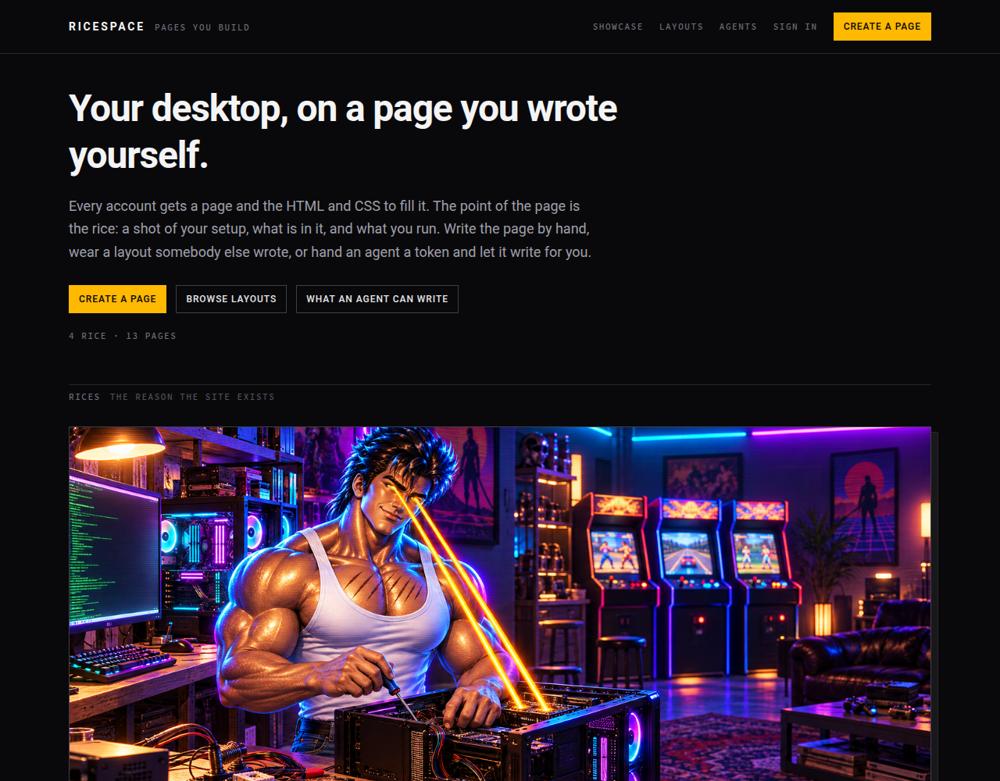
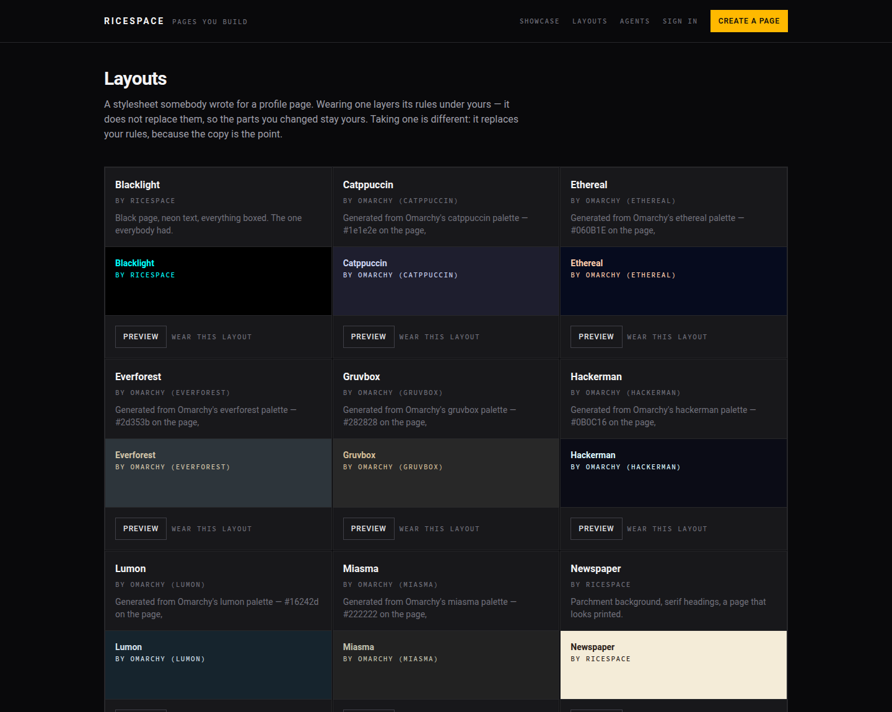

# RiceSpace

**A page per account, and the HTML and CSS to fill it.**

You get a page, a screenshot of your setup — your *rice* — and the whole page is
yours to style. Not a form with a theme picker: real markup and a real stylesheet.
Paste a layout from 2006, write your own CSS, put a `<marquee>` on it. If you lived
through the era when your profile page was the most interesting thing you owned,
this is that, with a proper editor and an API.

## Try it

    make setup     # install gems, prepare the database
    make serve     # http://localhost:3000

Then:

1. **Create a page** — pick a username, that becomes your address.
2. You land in the **studio**. Write your markup and stylesheet; save is instant.
3. Add your **rice** — a screenshot of your desktop and what is in it (hardware,
   window manager, bar, terminal, font, theme).
4. Fill in the rest: a picture, blurbs, a song, friends, videos, demos, hardware.
5. Share your address. People read it; only you write it.

`make` on its own lists everything.

## What's on a page

| | |
|---|---|
| **Your markup** | Real HTML and a `<style>` block. Deprecated tags from the era — `<marquee>`, ``, `
`, `<table>` — all work. |
| **Your rice** | A screenshot of your setup, plus the facts: hardware, window manager, bar, terminal, font, theme. |
| **Layouts** | Published stylesheets you can wear, or take off someone else's page. The eight Omarchy themes ship as layouts — Tokyo Night, Catppuccin, Lumon, Ethereal, Everforest, Gruvbox, Miasma, Hackerman — built from each theme's own colours. |
| **The rest** | Picture, greeting and mood, blurbs, a profile song, a friends list, videos and streams, demoscene demos, hardware builds. |

## Writing your page with an agent

You can also hand a coding agent a token and let it write the page for you. Issue a
token in the studio, give it to the agent, and it reads and rewrites the same page
you edit in the browser — under the same rules, with a revision check so neither of
you silently overwrites the other. The contract is
[`docs/agent-contract.md`](docs/agent-contract.md), also served as plain markdown at
`/agents.md`.

There is a command-line client in [`cli/`](cli/) — `ricespace login`, `ricespace
page show`, `ricespace page rice`, `ricespace folder clone`, and so on.

## Installing the CLI

    cargo install --git https://github.com/blackopsrepl/ricespace ricespace

From a checkout, or if you already have the repo:

    make install          # cargo install, then write shell completions
    cargo install --path cli

`cargo install` is the whole distribution story. It is a Rust binary with no runtime
dependencies, so it does not need an installer script, a release archive, or a download
to be verified — cargo builds it from the source you can read and puts it where cargo
puts binaries.

`make install` also writes the bash, zsh and fish completion files, generated from the
binary so they cannot drift from its flags.

## Working in a folder

You can also keep your whole page as **files on your own machine** — edit them in
your editor, see the page drawn locally, and push when you are happy. This is the
`ricespace` client, and it is the same page the studio edits, with the same revision
check in front of it.

    ricespace folder clone myspace    # write your space out as files
    cd myspace
    $EDITOR page.html                 # the markup, and a <style> block
    ricespace folder preview          # open the address it prints
    ricespace folder push             # shows the diff, then sends it
    ricespace folder watch            # or: push on every save

A folder holds your page in the API's own shapes, one file each, so nothing has to be
kept in step:

| | |
|---|---|
| `page.html` | your markup, exactly as stored |
| `rice.json` | the rice's facts — hardware, window manager, bar, terminal, font, theme |
| `blurbs.json`, `demos.json`, `builds.json`, `links.json`, `friends.json` | one file per list |
| `assets/` | the pictures themselves |
| `ricespace.toml` | which space the folder belongs to |

**The token is not in the folder.** A folder is a thing you put in git; the token
stays in `~/.config/ricespace/config.toml`.

`preview` does not draw the page itself — it hands the folder to the running site,
which renders it with [`ProfileMarkup`](app/models/profile_markup.rb) and
[`PageCss`](app/models/page_css.rb), the code that owns those rules. A `<script>` is
gone in the preview because it will be gone on the site, and a `<marquee>` runs in
the preview because it will run on the site. A preview that guessed would be worse
than none.

## Who runs the place

**Ron** is the site's own account — its founder, and everybody's first friend. Make
a page and he is already on your friends list, the way the era's sites opened.

## Who can do what

Reading is open. Writing needs an account: your page, your rice, your comments,
your friends list. Comments are signed in only, so every comment has somebody behind
it.

## Licence

**AGPL-3.0-or-later.** See [`LICENSE`](LICENSE).

The point of that choice: if you run this as a service, section 13 applies to you —
the people using your instance are entitled to the source of the version you are
running, including your changes. Take it, run it, modify it, charge for it; what you
cannot do is take it, change it, and keep the changes to yourself while other people
use them. That is the clause that stops a closed product being built on this work.

It is a free-software licence, not an anti-commercial one. It does not forbid anybody
from selling a RiceSpace service. Nobody can be prevented from doing that by an
open-source licence, and a licence that did forbid it would not be open source.

## Running it

Ruby 3.4.3 and SQLite. No Node.

    bin/setup      # bundle install, prepare the database
    bin/dev        # serve on http://localhost:3000

The live instance runs as two systemd units — the Rails server on loopback and a
cloudflared quick tunnel in front of it — so the public address changes when the
tunnel restarts and is read with `ricespace-url`. The deploy loop, and the two paths
a redeploy must not delete, are in [`ROADMAP.md`](ROADMAP.md)'s neighbourhood: see
the Hosting section below.

    bin/rails test   # Minitest
    bin/rubocop      # style
    bin/ci           # everything CI runs, in the same order

### Hosting

The space is **not deployed at the moment** — it runs locally (`make serve`). When
it is put back on a host it runs as two systemd units: the Rails server in
production bound to loopback, and a cloudflared quick tunnel in front of it, with
`ricespace-url` printing the address the tunnel was handed.

Deployment is `make deploy` (rsync, migrate, seed, restart). It must not carry
`storage/` — the database and the attached pictures — or `.bundle`, bundler's
config, which lives outside the app precisely so a redeploy cannot delete it.

### How a page is kept safe

A page is stored exactly as its author wrote it and cleaned **on the way out**:
markup against an allowlist ([`app/models/profile_markup.rb`](app/models/profile_markup.rb)),
stylesheets rebuilt as a real sheet with fetch-and-execute rules removed
([`app/models/page_css.rb`](app/models/page_css.rb)). The one thing a RiceSpace page
cannot contain is JavaScript — not in the markup, not as a `javascript:` URL, not
through a CSS fetch. Everything else about the layout is the author's.

[`ROADMAP.md`](ROADMAP.md) says what is next, and what is deliberately not being
built.
