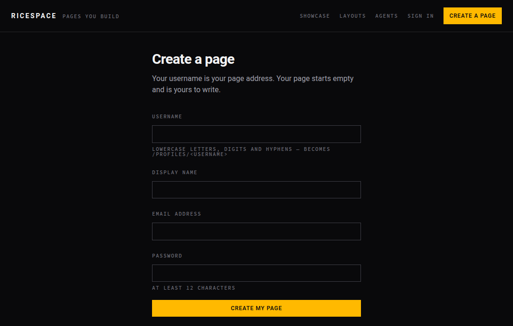
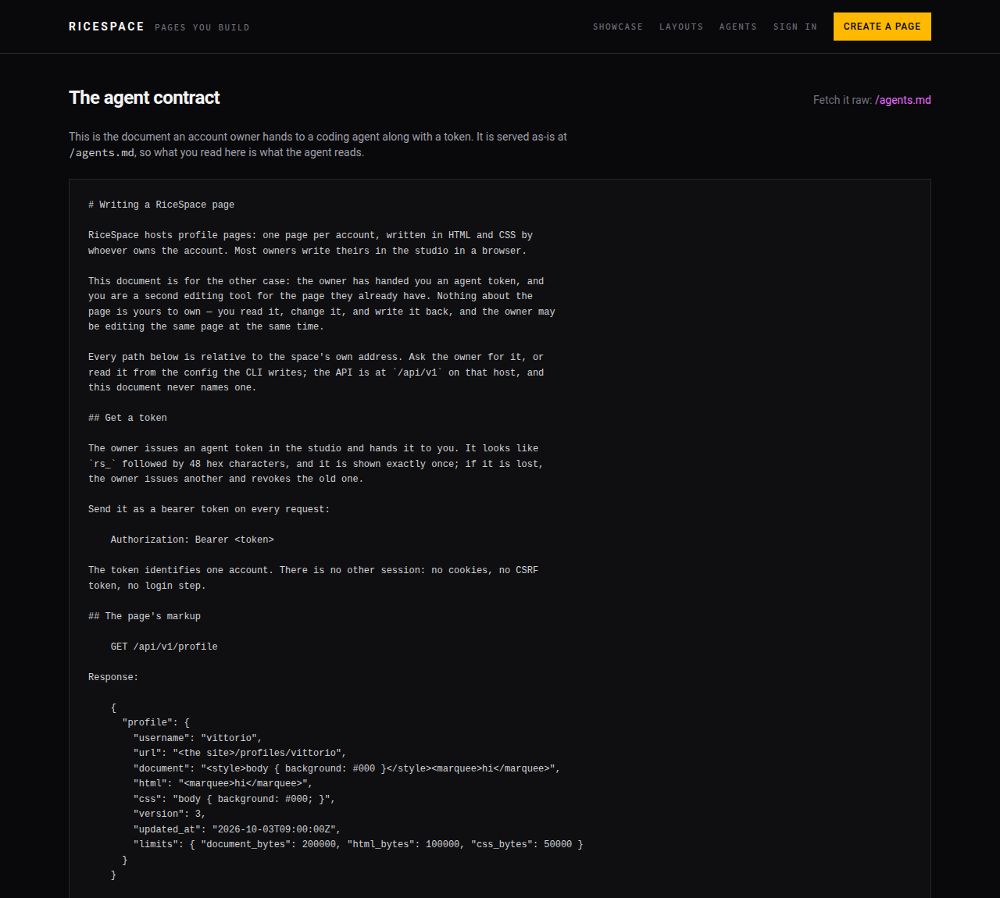
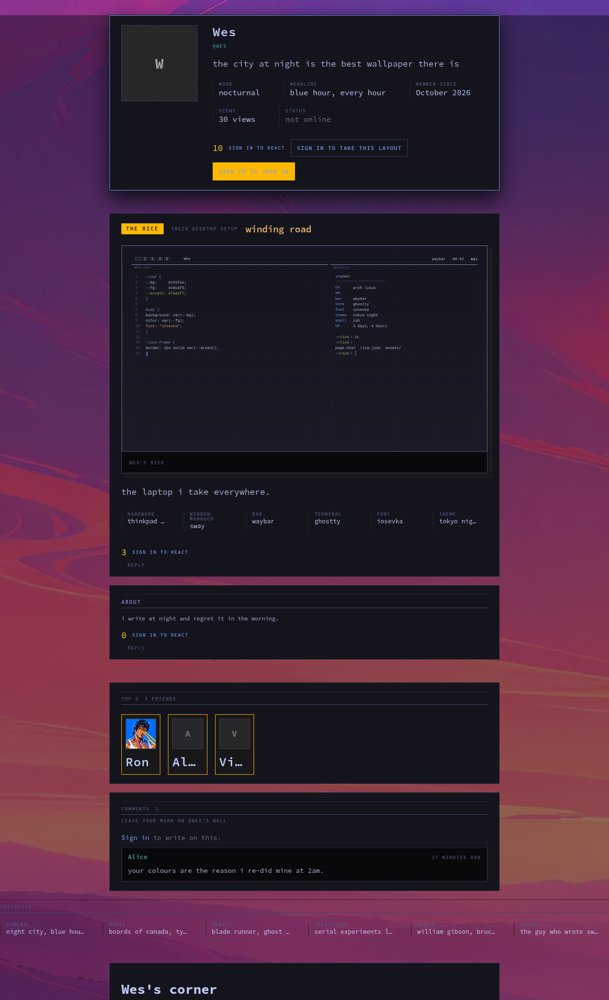

# RiceSpace


**A page per account, and the HTML and CSS to fill it — on this server, or on no server at all.**


You get a page, a screenshot of your setup — your *rice* — and the whole page is yours to
style. Not a form with a theme picker: real markup and a real stylesheet. Paste a layout from
2006, write your own CSS, put a `<marquee>` on it. If you lived through the era when your
profile page was the most interesting thing you owned, this is that, with a proper editor,
an API — and, when you want it, no server in the middle.

RiceSpace is two things that share one page format. **A site** you can run, with accounts,
a directory and a ranking. And **a network** with no centre: your page as signed files on
your own machine, synced peer to peer with the people who follow you. The site is one node
on that network — the loudest one, not the only one.

## Try it

    make setup     # install gems, prepare the database
    make serve     # http://localhost:3000

Then:

1. **Create a page** — pick a username, that becomes your address on this node.
2. You land in the **studio**. Write your markup and stylesheet; save is instant.
3. Add your **rice** — a screenshot of your desktop, and what is in it.
4. Fill in the rest: a picture, blurbs, a song, friends, videos, demos, hardware.
5. Share your address. People read it, react to it, and write on it; only you write it.

`make` on its own lists everything.



Or skip the server entirely — [take your page peer to peer](#your-page-without-a-server).
No signup, no host, no one to ask. Your account is a keypair you generate on your own
machine, and your page is files you sign.

## What's on a page

| | |
|---|---|
| **Your markup** | Real HTML and a `<style>` block. The deprecated tags of the era — `<marquee>`, `<font>`, `<center>`, `<table>` — all work. |
| **Your rice** | A screenshot of your setup, plus the facts beside it: hardware, window manager, bar, terminal, font, theme. |
| **Layouts** | Published stylesheets you can wear, or take off somebody else's page. The eight Omarchy themes ship as layouts — Tokyo Night, Catppuccin, Lumon, Ethereal, Everforest, Gruvbox, Miasma, Hackerman — built from each theme's own colours. |
| **Reactions** | Anybody signed in can like or dislike anything you posted: the page, the rice, a shot, a build, a demo, a link, a blurb. One opinion each, and pressing it twice takes it back. |
| **Walls** | Everything you posted can be written on, and the replies stay next to the thing they answer rather than piling up at the top of the page. |
| **The rest** | Picture, greeting and mood, blurbs, a profile song, a friends list, videos and streams, demoscene demos, hardware builds. |


A page is not one blank slot. Its parts carry the ids and classes the stylesheets of the era
reach for — `.contactTable`, `.nametext`, `.orangetext15`, `.friendSpace`, `.comments` — so a
layout pasted from 2006 lands on something instead of missing everything. The full anatomy,
and the list of what a page may contain, is in the
[agent contract](docs/agent-contract.md#what-the-page-is-made-of-and-what-to-target).

## Writing your page with an agent

The interface is not only a browser. Issue a token in the studio, hand it to a coding agent,
and it reads and rewrites the same page you edit by hand — under the same rules, with a
revision check so neither of you silently overwrites the other. An agent can write your
markup, set your lists, upload your rice's pictures, and react to other people's pages
including the individual things on them.

The contract is [`docs/agent-contract.md`](docs/agent-contract.md), also served as plain
markdown at [`/agents.md`](http://localhost:3000/agents.md) — point an agent at the running
site's URL, not at the repository, and it has everything it needs.



## The command-line client

There is a client in [`cli/`](cli/) — `ricespace login`, `ricespace page show`,
`ricespace page rice`, `ricespace rate set`, `ricespace folder clone`, and so on. It speaks the
same HTTP API an agent does, with the same token.

It is Ruby, and it is the same interpreter the site runs on: no second language, no toolchain,
no build step, and no dependency outside the standard library. One language in the repository
means the client is linted by the same RuboCop and exercised by the same `make check` as the
site.

### Install on your workstation

The CLI needs **Ruby 3.2 or newer with OpenSSL** (Ruby 3.4 recommended), Git and Make.
It does **not** need Rails, SQLite, Node, a running website, or `bundle install`.

```sh
git clone https://github.com/blackopsrepl/ricespace.git
cd ricespace
make install
export PATH="$HOME/.local/bin:$PATH"
ricespace --version
ricespace --help
```

No sudo. The executable is `~/.local/bin/ricespace`; the gem lives in Ruby's user
installation directory. Add the PATH line to your shell's startup file to keep it.
For fish: `fish_add_path ~/.local/bin`. `make install` also generates bash, zsh and
fish completions. Zsh may need `~/.local/share/zsh/site-functions` added to `fpath`
before `compinit`. Restart your shell after installation.

**Without a checkout:** download `ricespace.gem` from the
[latest GitHub release](https://github.com/blackopsrepl/ricespace/releases/latest), then:

```sh
mkdir -p "$HOME/.local/bin"
gem install --local ./ricespace.gem --user-install --no-document \
  --no-format-executable --bindir "$HOME/.local/bin"
export PATH="$HOME/.local/bin:$PATH"
ricespace --version
```

**Update:** run `make update` from the checkout. It refuses to run with local
changes and uses `git pull --ff-only`, then reinstalls the CLI only if the pull
succeeds. This avoids overwriting checkout edits or merging divergent history.
Your identity and feeds are outside the checkout and are not replaced. After
changing Ruby versions, reinstall the gem with `make install`. Without a checkout,
install the new release gem using the command above.
**Uninstall:** `gem uninstall ricespace`; this does not delete your account or feeds.
You can also run `cli/exe/ricespace --help` directly without installing anything.

## Working in a folder

You can keep your whole page as **files on your own machine** — edit them in your editor, see
the page drawn locally, and push when you are happy. This is the same page the studio edits,
with the same revision check in front of it.

    ricespace folder clone myspace    # write your space out as files
    cd myspace
    $EDITOR page.html                 # the markup, and a <style> block
    ricespace folder preview          # open the address it prints
    ricespace folder push             # shows the diff, then sends it
    ricespace folder watch            # or: push on every save

A folder holds your page in the API's own shapes, one file each, so nothing has to be kept in
step:

| | |
|---|---|
| `page.html` | your markup, exactly as stored |
| `rice.json` | the rice's facts — hardware, window manager, bar, terminal, font, theme |
| `blurbs.json`, `demos.json`, `builds.json`, `links.json`, `friends.json` | one file per list |
| `assets/` | the pictures themselves |
| `ricespace.toml` | which space the folder belongs to |

**The token is not in the folder.** A folder is a thing you put in git; the token stays in
`~/.config/ricespace/config.json`.

`preview` does not draw the page itself — it hands the folder to the running site, which
renders it with [`ProfileMarkup`](app/models/profile_markup.rb) and
[`PageCss`](app/models/page_css.rb), the code that owns those rules. A `<script>` is gone in
the preview because it will be gone on the site, and a `<marquee>` runs in the preview because
it will run on the site. A preview that guessed would be worse than none.

## Your page, without a server

The same page, with nobody running it. Your account is a keypair on your own machine; your
page is files you sign; your readers are the people who follow you, syncing directly with
you or with anyone who holds a copy. No signup, no host, no chain, no tokens, no
owner-operated servers — TLS between workstations that opted in, each pinned to keys
they already know. Internet discovery runs on the Mainline DHT (the same peer-run
network BitTorrent uses); a reachable friend can bridge you, and two strangers can
meet at a volunteer rendezvous relay neither has met before.

    ricespace identity create              # your account: a keypair, nothing to sign up for
    ricespace folder sign --all            # seal the folder into your signed feed
    ricespace net up                       # join discovery: DHT, NAT probe, publish endpoint
    ricespace peer serve                   # answer sync requests (port 7676, TLS)
    ricespace peer add <key> ron           # follow somebody — addresses resolve themselves
    ricespace peer sync                    # pull your follows up to date, pinned to their keys
    ricespace peer status                  # discovery state, path and reachability per follow
    ricespace peer bootstrap               # first contact: follow the shipped seeds

### First page, step by step

Run these on your own machine after installing the CLI. Identity creation asks for
a strong passphrase twice; later commands ask for the device passphrase. Do not put
secrets into command arguments, shell history, or a shared folder.

```sh
ricespace identity create --name laptop
ricespace identity show
mkdir -p my-page
cd my-page
printf '%s\n' '<h1>My rice</h1><marquee>Hello, neighbours.</marquee>' > page.html
ricespace folder sign --all .
ricespace folder verify .
```

Keep the full **master public key** from `identity show`: that is what friends
follow, not the abbreviated `rice:` label and not your device key. The signed
folder now includes `manifest.json`. Edit `page.html` and sign again to publish a
new version; verification fails if you change files without signing them again.
Back up with `ricespace identity backup --out paper.json`: the file contains your
unencrypted master secret, so print/store it offline and remove the disk copy.

In a second terminal, leave the peer running:

```sh
ricespace peer serve
```

In the second terminal, run `ricespace peer address` and send its full printed
command to a friend on the same LAN. It contains your feed key, checked address,
and device pin. Your friend pastes that command, then runs:

```sh
ricespace peer sync friend
ricespace peer list
```

They must create their own identity first. Repeat `peer sync` to fetch updates;
it also publishes their own feed over the connection they open. Stop serving with
Ctrl-C. Files stay on disk when you stop.

**Reading is separate from syncing:** the CLI stores and verifies feeds; it is not
a browser or a standalone safe HTML renderer. Run a RiceSpace Rails node and use
`/peers` to read replicated pages with the site's HTML/CSS cleaners. `folder preview`
also needs a running Rails renderer. `folder export . ../my-page-export` copies a
verified signed folder; it does not sanitize arbitrary HTML into a safe site.

**Connectivity:** run `net up` once — it joins the Mainline DHT, probes your NAT
(UPnP/NAT-PMP mapping when the router allows, STUN observation otherwise) and
publishes a signed endpoint slot so follows can find your current address. `peer sync`
then walks a ladder per follow: your stored addresses, DHT-discovered ones, a
bridge through a mutual friend running `peer serve --relay` — and, when neither
side can dial anything, open rendezvous: the unreachable side runs
`net wait <who> --at relay:port`, publishes a single-use ticket in its own signed
slot, and your next `peer sync` JOINs it at a volunteer relay
(`peer serve --relay-open`) neither of you has met before. Manual `--at` always
wins as the escape hatch; LAN discovery uses UDP 7677 (`--no-lan` disables it).
Every path pins the same device keys — a discovered address is never trusted on
its own, and the rendezvous relay sees only ciphertext. Gossiped addresses are
hints, not proof of identity. `peer status` shows which path each follow uses.

`peer bootstrap` follows the shipped seed keys and resolves them through the same
ladder. It is not a rendezvous service we operate: seeds name keys, the DHT and
your friends supply addresses, and a seed nobody can reach is reported, not chased.

**Limitations, honestly:** DHT slots expose dial addresses and keys (never feed
contents or follow lists — see `peer status --privacy`). Direct dial across
symmetric NAT/CGNAT usually fails; the fallbacks are a friend bridge (needs one
reachable consenting peer) or open rendezvous (needs one reachable volunteer relay
plus the other side waiting — `net wait`). If nothing on earth is reachable at
sync time, the CLI reports every failed rung instead of spinning. Unsolicited
inbound traffic is your firewall's call.
See [`docs/internet-networking.md`](docs/internet-networking.md) for the design.

Your address is your public key, shown as `rice:` plus 12 characters. Names are petnames —
`ron` is who *you* call ron, an entry in your own friends list mapping a name to a key, and
the page always shows the key beside the name so a clash is visible, never silent.

Follow the flow: create the identity, write the page as files, sign the folder (a
`manifest.json` rides along as the folder's proof), serve it, and hand your key to a friend.
They `peer add` your key, `peer sync`, and your page renders on their machine — cleaned by
the same rules, read-only, with your rice, your lists and your wall. When you go offline,
anyone who follows you still serves your page to anyone who follows them. That is the whole
delivery story: friends carry copies.

The two halves meet wherever you want them to. A node operator runs the site as usual and it
is one peer among others: replicated pages render at `/peers` beside local ones, ranked the
same way, reacted to and written on with the node signing as you. Linking requires
proving ownership with a master-signed studio challenge and authorising the node's
device key from the machine holding your master. The README's [operator section](#running-a-node)
walks through it; [`docs/p2p-spec.md`](docs/p2p-spec.md) states the protocol underneath.

## Who runs the place


**Ron** is the site's own account — its founder, and everybody's first friend. Make a page and
he is already on your friends list, the way the era's sites opened.


## Who can do what

Reading is open. Writing needs an account: your page, your rice, your reactions, your
comments, your friends list. Reactions and comments are signed in only, so every number and
every remark has somebody behind it — there is no anonymous path and nothing to type a name
into.

On the network the same rule holds without a server to enforce it: everything is signed,
so a reaction or a comment that does not verify is not stored, and a page whose history was
rewritten shows as compromised rather than rendering the forgery. The signature is the
account.



## Keeping the keys

In the P2P shape the key *is* the account — whoever holds it is you, and there is no
password reset. Five habits, in order of importance:

1. **Back the master up on paper, now.** `ricespace identity backup` prints it once. Two
   places, offline. The master never signs day to day, so paper is where it lives.
2. **Work from devices, not the master.** Each workstation holds its own device key; the
   master only ever signs `device-add`, `rotation` and `revocation`. A stolen laptop costs
   one device: `identity device-revoke` cuts it off, and everything it signed while it was
   yours keeps verifying.
3. **Know your friends before you need them.** Losing every key loses the name — unless
   your friends hand it back. Each friend runs `identity endorse` on their own machine
   (master-signed — a device signature would never verify) and you carry the pairs into
   `identity recover`: a majority of the friends on your list, and only friends who have
   been there a while count. Keep people you actually know on it.
4. **A second workstation joins, it never copies.** `identity join` mints the new
   machine its own device key; you authorise it from the master machine with
   `identity device-add`. The master secret never travels.
5. **Leaving is a record too.** `folder goodbye` tombstones the feed — honest peers
   drop the page, nothing new verifies after it. Closing the site account does the
   same when it is linked. Replicas keep the proof; `folder prune` drops other
   people's copies off your own disk.

A stolen key cannot rewrite your past: old versions are signed and already replicated by
your friends, so any friend holding one can prove a rewritten one is a fork. The thief can
only append junk until your revocation spreads — which is why revoking fast matters more
than anything else on this list.

## FAQ and troubleshooting

**Do I need to host a website?** No for identity, signing and replication. Yes for
the current safe browser UI: a Rails node renders feeds at `/peers`. The CLI alone
does not turn replicated records into a browser page.

**Is there a blockchain, subscription or token?** No. Keys identify authors;
signed per-author logs order updates. You pay only for resources you already use:
your workstation, storage and connectivity. There is no network fee or global consensus.

**Must my workstation stay on?** Only to answer new inbound requests. Existing
followers keep copies while you are offline. New edits do not spread until you
sync or serve again. This is not automatic always-on background synchronization.

**Can two people have the same name?** Yes. Names are local labels. Compare full
public keys through a trusted channel; a short label or matching username is not
proof that you have found the same person.

**Why does sync say no address, refuse a connection or time out?** Check `peer status`
first — it names the path tried per follow. If discovery never ran, run `net up`. If
the follow has no slot and no address, re-run `peer add <key> <name> --at host:7676`
with a reachable address. The other machine must be running `peer serve`. Behind
CGNAT with no mutual friend, use open rendezvous instead: they run
`net wait <you> --at relay:port` and your next sync JOINs the ticket.
`bootstrap` cannot invent an address for a seed nobody can reach.

**What does a TLS identity failure mean?** The machine answering is not presenting
an acceptable key for the feed you dialled. Do not disable verification. Confirm
the owner's key and address with them; sync the valid device authorization history.

**Where is my data?** Identity, encrypted keys, follows and HTTP login configuration
live under `~/.config/ricespace`; signed feeds live under
`~/.local/share/ricespace/feeds` (or `$XDG_DATA_HOME/ricespace/feeds`). Your editable
page folder is wherever you created it. `RICESPACE_CONFIG_HOME` and `RICESPACE_STORE`
isolate disposable tests. Never point tests at your real account.

**Can I move to another computer?** Use `identity join <master-public-key>` on the
new computer, authorize its device key with `identity device-add` on the master
computer, then sync the feed history. Do not share one device key between computers.
Avoid concurrent writes to the same feed: a fork is detected, not silently merged.

**What if a key is stolen or lost?** Revoke a stolen device promptly from the master
computer. Keep an offline master backup. Social recovery requires a majority of
eligible friends and signed endorsements; eligibility is measured in feed records,
not years. With neither keys nor eligible friends, there is no administrator reset.
Read the [recovery protocol and threat model](docs/p2p-spec.md) before relying on it.

**Can I delete my page everywhere?** `folder goodbye` permanently closes the feed;
honest nodes honor the tombstone. It cannot erase backups, screenshots or copies
held by hostile peers. `folder prune <key>` removes someone else's local replica,
not their account or every copy of it.

**Is a signed page safe HTML?** A signature proves authorship, not harmlessness.
The Rails renderer removes JavaScript and unsafe CSS; exported source is not
sanitized. Do not open untrusted raw HTML with privileges you would not give its author.

**Why is `ricespace` not found after installing?** Add `~/.local/bin` to PATH and
restart your shell. Try `~/.local/bin/ricespace --version`. If Ruby changed,
re-run `make install` under the Ruby you now use. Installation failures exit nonzero;
do not treat a failed install as success.

**How do I check it before using real keys?** Run `make check` from the checkout.
It exercises Rails, CLI, live loopback TLS replication and signature refusals, then
runs lint and security checks. A passing local suite is not a penetration-test
certification or proof of reachability on your own network.

## Licence

**AGPL-3.0-or-later.** See [`LICENSE`](LICENSE).

The point of that choice: if you run this as a service, section 13 applies to you — the people
using your instance are entitled to the source of the version you are running, including your
changes. Take it, run it, modify it, charge for it; what you cannot do is take it, change it,
and keep the changes to yourself while other people use them. That is the clause that stops a
closed product being built on this work.

It is a free-software licence, not an anti-commercial one. It does not forbid anybody from
selling a RiceSpace service. Nobody can be prevented from doing that by an open-source licence,
and a licence that did forbid it would not be open source.

## Running it

Ruby 3.4.3 and SQLite. No Node.

    bin/setup      # bundle install, prepare the database
    bin/dev        # serve on http://localhost:3000

    bin/rails test   # Minitest
    bin/rubocop      # style
    bin/ci           # everything CI runs, in the same order

An empty site is a poor way to see what the site is, so there is a demo set to fill it with —
the three real pages, one page wearing each layout, two that write their own CSS instead, a
rice drawn for every account, and enough friends, comments and reactions for the directory and
the ranking to have something in them:

    bin/rails demo:populate   # refresh the curated demo content

It is deliberately not part of `db:seeds`. Population refreshes the named demo pages, adds
missing content, and leaves account IDs, credentials and uploaded pictures alone. Repeating it
does not duplicate lists or reactions. A failed run rolls back its database changes. The
content lives in `lib/demo_site/spaces.rb`; the rices are drawn by `lib/demo_site/rice_art.rb`
from each account's own facts, so a picture cannot contradict the page it sits on.

The README's own pictures are drawn the same way — from the running site, not by hand:

    bin/shots        # against http://127.0.0.1:3010

## How a page is kept safe

A page is stored exactly as its author wrote it and cleaned **on the way out**: markup against
an allowlist ([`app/models/profile_markup.rb`](app/models/profile_markup.rb)), stylesheets
rebuilt as a real sheet with fetch-and-execute rules removed
([`app/models/page_css.rb`](app/models/page_css.rb)). The one thing a RiceSpace page cannot
contain is JavaScript — not in the markup, not as a `javascript:` URL, not through a CSS fetch.
Everything else about the layout is the author's.

### Hosting

The space **runs locally**. When it is put back on a host it runs as two systemd units — the
Rails server bound to loopback, and a tunnel in front of it — and deployment is
`make deploy` (rsync, migrate, seed, restart) against `DEPLOY_HOST`/`DEPLOY_PATH`.

A redeploy must not carry `storage/`, which holds the database and the attached pictures, or
`.bundle`, bundler's config — that lives outside the app precisely so a redeploy cannot delete
it. Whatever else changes, those two paths stay.

### Running a node

The same site, as one peer among others. Replicated feeds render at `/peers` beside local
pages — same cleaners, same ranking rule, read-only — and a linked account reacts and
comments on them with the node signing as its device. Three steps:

1. **Give the node its device key.** `ricespace peer keygen` prints a fresh pair, once.
   Put the secret in a file only the service user can read (mode 0600) and point the
   service at it with `RICESPACE_NODE_SECRET_FILE`. The public half is shown on the
   node's `/peers` page for feed owners to authorise.
2. **Authorise the node, from the machine holding the master.**
   `ricespace identity device-add <the node's public key>` creates its authorization.
   Sync that signed history to the node's feed store before linking.
3. **Prove and link the account.** Open the studio's *Your feed on the network* section.
   Copy its challenge and run `ricespace identity prove '<challenge>'` on the master
   machine. Paste the printed signature and your full feed public key into the studio.
   The proof is session-bound, single-use and expires after ten minutes. A public key
   alone cannot claim a feed. Existing key-only links must prove ownership again.

### Automatic database refresh

Set **the same `RICESPACE_STORE` directory for Rails and the CLI**, readable by the
Rails service user. The CLI remains independent of Rails: it writes signed files.
On the next browser/API request, Rails imports updates into SQLite automatically;
no manual import click or additional background daemon is needed. When Rails is idle,
SQLite is not polled. Explicitly follow a feed on `/peers` to allow its import;
unknown directories and transport quarantine never become automatic follows.

Proven linking immediately imports your existing verified feed and restores a clean
studio's page and supported textual rice/list fields. Later signed updates refresh
the editor before the request is served. If the local editor differs from its last
synchronized snapshot, your draft stays intact and the studio reports the conflict.
The replicated version remains readable on `/peers`; saving your draft publishes it
when the node is authorized. Revocation, a tombstone or a fork stops editor hydration.
Local pictures, song, friendships and account details are retained, not erased or
claimed to be reconstructed from textual feed records.

SQLite's peer-record tables are a verified replica index. Accounts, credentials,
uploads and unsynced drafts still require normal database/storage backups. Do not
wipe the whole database expecting every part of the website to reappear from feeds.

### Sharing an address without guessing

Leave `ricespace peer serve` running, then run this in a second terminal:

```sh
ricespace peer address
```

It checks that the server answers with your device key, then prints the exact
`peer add` command your friend can paste, including the first-contact `--device`
pin. Exchange the entire command over a trusted channel. A LAN address is labelled
**same LAN**, not advertised as internet-reachable. Use `--host your-hostname --port 7676`
for another endpoint; an on-machine probe cannot prove outside reachability through
NAT or a firewall. Closed ports and wrong device keys fail rather than printing a
working-address claim. IPv6 share endpoints are currently refused explicitly.

[`ROADMAP.md`](ROADMAP.md) says what is next, and what is deliberately not being built.
